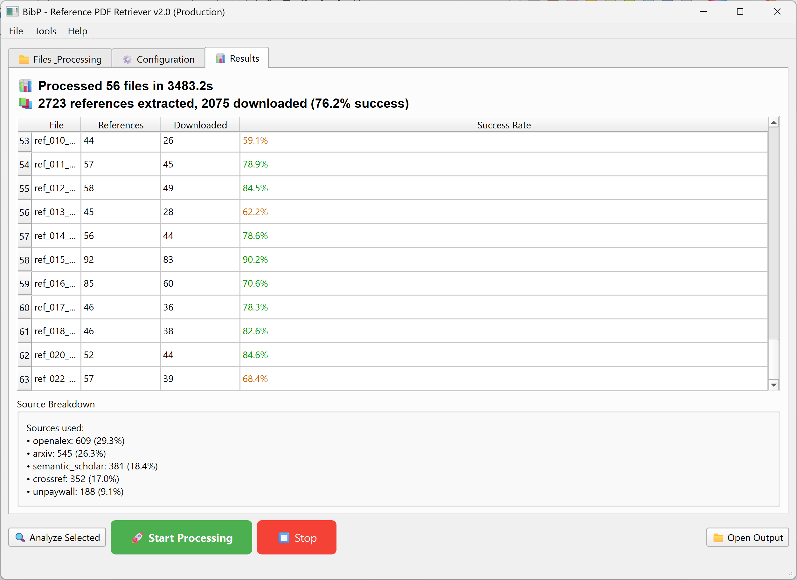

# BibP v2.0 - Reference PDF Retriever

**Automatically download open-access PDFs from academic paper references with cutting-edge extraction and multi-API resolution.**

[](https://www.python.org/downloads/)
[](https://opensource.org/licenses/MIT)
[](https://grobid.readthedocs.io/)

## Key Features

- **GROBID Integration** - Superior reference extraction with structured metadata
- **Multi-API Support** - 7+ APIs for maximum coverage (arXiv, OpenAlex, Semantic Scholar, PubMed, etc.)
- **Intelligent Prioritization** - Smart source ordering for optimal success rates
- **Parallel Processing** - Configurable threading with intelligent rate limiting
- **Real-time Analytics** - Live progress tracking and success rate monitoring
- **Robust Error Handling** - Automatic retries and graceful degradation
- **Modern GUI** - Tabbed interface with drag-and-drop support
- **CLI Mode** - Command-line interface for automation and scripting

## What's New in v2.0



### Complete Architecture Overhaul
- **Production-ready codebase** with comprehensive error handling
- **Modular design** with clear separation of concerns
- **Configuration management** with environment variable support
- **Comprehensive logging** and debugging capabilities

### Enhanced Reference Extraction
- **GROBID integration** for state-of-the-art reference parsing
- **Quality scoring** system for reference validation
- **Fallback mechanisms** (GROBID → refextract)
- **Smart query cleaning** to improve API match rates

### Expanded API Coverage
| API | Coverage | Rate Limit | Priority |
|-----|----------|------------|----------|
| **arXiv** | Preprints (CS/Math/Physics) | 10/s | 1 |
| **Unpaywall** | DOI-based OA papers | 5/s | 2 |
| **OpenAlex** | Comprehensive academic papers | 10/s | 3 |
| **Semantic Scholar** | CS/AI papers + cross-domain | 0.8/s | 4 |
| **Crossref** | DOI resolution | 2/s | 5 |
| **PubMed/PMC** | Biomedical papers | 3/s | 6 |
| **CORE** | UK repositories | 1/s | 7 |

### Advanced Analytics & Monitoring
- **Real-time success rate tracking**
- **Source attribution and statistics**
- **Reference extraction quality analysis**
- **Performance metrics and response times**

## Quick Start

### 1. Clone and Install
```bash
# Clone the repository
git clone https://github.com/wakeleyresearch/bibp.git
cd bibp

# Install Python packages
pip install -r requirements.txt
```

### 2. Configure BibP
```bash
# Copy configuration template
cp config_template.py config.py

# Edit config.py and replace:
# - YOUR_EMAIL_HERE with your email address
# - YOUR_SEMANTIC_SCHOLAR_API_KEY_HERE with your API key (get from https://www.semanticscholar.org/product/api)
```

### 3. Start GROBID
```bash
# Start GROBID Docker container (required for best reference extraction)
docker run --rm --init -p 8070:8070 grobid/grobid:0.8.1
```

### 4. Launch BibP
```bash
# GUI mode (recommended)
python main.py

# CLI mode
python main.py --cli paper.pdf

# Test installation
python main.py --test
```

## Usage Guide

### GUI Mode (Recommended)
1. **Launch BibP**: `python main.py`
2. **Add PDFs**: Drag & drop or use "Add Files" button
3. **Configure**: Check the Configuration tab for API settings
4. **Process**: Click "Start Processing" and monitor progress
5. **Results**: View statistics and download locations in Results tab

### CLI Mode
```bash
# Process single PDF
python main.py --cli research_paper.pdf

# Use specific extraction method
python main.py --cli paper.pdf --method grobid

# Verbose output
python main.py --cli paper.pdf --verbose

# Analyze reference quality
python main.py --diagnose paper.pdf
```

### Configuration Options
```bash
# Set via environment variables
export BIBP_EMAIL="your-email@domain.com"
export SEMANTIC_SCHOLAR_API_KEY="your-api-key"
export BIBP_MAX_THREADS=16
export GROBID_URL="http://localhost:8070"

# Or use the provided configuration script
source bibp_config.sh
```

## System Architecture

### Core Components

```
┌─────────────────┐    ┌─────────────────┐    ┌─────────────────┐
│   GUI/CLI       │    │   Extractor     │    │   Downloader    │
│                 │    │                 │    │                 │
│ • PyQt6 GUI     │───▶│ • GROBID Client │───▶│ • Multi-API     │
│ • CLI Interface │    │ • refextract    │    │ • Rate Limiting │
│ • Progress      │    │ • Quality Check │    │ • Parallel Proc │
└─────────────────┘    └─────────────────┘    └─────────────────┘
         │                       │                       │
         │                       │                       │
         ▼                       ▼                       ▼
┌─────────────────┐    ┌─────────────────┐    ┌─────────────────┐
│   Config        │    │   GROBID        │    │   API Clients   │
│                 │    │                 │    │                 │
│ • Settings      │    │ • Docker        │    │ • Semantic S2   │
│ • Validation    │    │ • XML Parser    │    │ • OpenAlex      │
│ • Environment   │    │ • Reference     │    │ • Crossref      │
└─────────────────┘    └─────────────────┘    └─────────────────┘
```

### Reference Processing Pipeline

```
PDF Input
    │
    ▼
┌─────────────┐     ┌─────────────┐     ┌─────────────┐
│   GROBID    │────▶│  Quality    │────▶│   Clean &   │
│ Extraction  │     │  Analysis   │     │  Normalize  │
└─────────────┘     └─────────────┘     └─────────────┘
    │                                           │
    │ (fallback)                               ▼
    ▼                                   ┌─────────────┐
┌─────────────┐                        │  Multi-API  │
│ refextract  │                        │  Resolution │
│ Extraction  │                        └─────────────┘
└─────────────┘                               │
                                              ▼
                                      ┌─────────────┐
                                      │ PDF Download│
                                      │ & Validation│
                                      └─────────────┘
```

## Advanced Configuration

### API Rate Limiting
```python
# Custom rate limits (requests/second) in config.py
config.apis['semantic_scholar'].rate_limit = 1.0
config.apis['openalex'].rate_limit = 15.0
config.apis['unpaywall'].rate_limit = 10.0
```

### GROBID Settings
```python
# Custom GROBID instance
config.grobid_url = "http://your-grobid-server:8070"
config.grobid_enabled = True

# Quality thresholds
config.min_reference_quality_score = 0.3
config.min_title_length = 10
```

### Processing Options
```python
# Threading and performance
config.max_threads = 16
config.min_pdf_size = 1000  # bytes

# File naming
config.max_filename_length = 150
config.output_dir_suffix = "_refs"
```

## Expected Performance

### Success Rates by Domain
| Domain | Typical Success Rate | Best APIs |
|--------|---------------------|-----------|
| **Computer Science (ML/AI)** | 70-90% | arXiv, OpenAlex, Semantic Scholar |
| **Computer Science (General)** | 60-80% | arXiv, OpenAlex, Semantic Scholar, Crossref |
| **Mathematics** | 50-70% | arXiv, OpenAlex, Crossref |
| **Biomedical** | 50-70% | PubMed/PMC, Unpaywall, OpenAlex |
| **Physics** | 60-80% | arXiv, OpenAlex, Crossref |
| **Engineering** | 40-60% | OpenAlex, Unpaywall, Crossref |

### Notes
- Performance varies significantly by paper age, venue, and field
- Recent ML/AI papers show exceptional success rates due to arXiv prevalence
- Older papers or non-CS fields may show lower success rates
- The multi-API approach provides robust fallback options

### Optimization Tips
1. **Use GROBID** - Dramatically improves extraction quality
2. **Get API Keys** - Semantic Scholar key increases rate limits
3. **Recent Papers** - Higher OA availability for papers after 2015
4. **Mixed Sources** - Diverse reference lists perform better
5. **Clean References** - Well-formatted bibliographies have higher success rates

## Troubleshooting

### Common Issues

#### Low Success Rate (< 10%)
```bash
# Diagnose reference extraction quality
python main.py --diagnose your_paper.pdf

# Check if GROBID is running
curl http://localhost:8070/api/isalive

# Test API connectivity
python main.py --test
```

#### GROBID Connection Issues
```bash
# Restart GROBID container
docker stop $(docker ps -q --filter ancestor=grobid/grobid:0.8.1)
docker run --rm --init -p 8070:8070 grobid/grobid:0.8.1

# Check Docker status
docker ps
```

#### API Rate Limiting
```bash
# Reduce thread count
export BIBP_MAX_THREADS=4

# Lower API rates
export BIBP_SEMANTIC_SCHOLAR_RATE=0.5
export BIBP_CROSSREF_RATE=1.0
```

### Debug Mode
```bash
# Enable verbose logging
python main.py --verbose

# Log API calls
export BIBP_LOG_API_CALLS=true

# Check configuration
python main.py --test
```

## Technical Details

### Reference Extraction Quality Metrics
- **Title Extraction Rate**: Percentage of references with clean titles
- **DOI Availability**: Percentage of references with valid DOIs  
- **Author Recognition**: Percentage with parsed author information
- **Quality Score**: Composite score (0.0-1.0) based on structured data availability

### API Integration Details
- **Rate Limiting**: Token bucket algorithm with burst handling
- **Error Handling**: Exponential backoff with jitter
- **Response Validation**: Content-type and size checks for downloaded PDFs
- **Metadata Extraction**: Comprehensive parsing of API responses

### Performance Characteristics
- **Memory Usage**: ~50-100MB base + ~10MB per concurrent download
- **CPU Usage**: Primarily I/O bound, scales with thread count
- **Disk Usage**: Output PDFs + temporary files during processing
- **Network**: Optimized for batch API calls with connection pooling

## Development

### Setup for Development
```bash
# Clone repository
git clone https://github.com/wakeleyresearch/bibp.git
cd bibp

# Install development dependencies
pip install -r requirements.txt

# Run automated setup (optional)
python setup_script.py

# Run tests
python main.py --test
```

### Contributing
1. **Fork** the repository
2. **Create** a feature branch: `git checkout -b feature-name`
3. **Test** your changes thoroughly
4. **Submit** a pull request with clear description

### Core API Functions
```python
# Reference extraction
from extractor import extract_references
references = extract_references("paper.pdf", force_method="grobid")

# Download processing
from downloader import download_references_parallel  
results = download_references_parallel(references, "paper.pdf")

# Configuration
from config import config
config.max_threads = 16
```

## Dependencies

### Required
- Python 3.8+
- Docker (for GROBID)
- PyQt6 (GUI framework)
- requests (HTTP client)
- refextract (fallback extraction)
- tenacity (retry logic)

### API Clients
- semanticscholar (Semantic Scholar API)
- habanero (Crossref API)

### Optional Enhancements
- Semantic Scholar API key (higher rate limits)
- Institutional API access (Web of Science, InCites)

## Roadmap

### v2.1 (Next Release)
- [ ] **Web of Science Integration** - Enhanced coverage for all domains
- [ ] **HAL Repository Support** - French academic repository
- [ ] **Citation Format Export** - BibTeX, EndNote, RIS output
- [ ] **Batch Processing API** - REST API for automated workflows

### v2.2 (Future)
- [ ] **Machine Learning Ranking** - AI-powered source prioritization
- [ ] **PDF Full-text Search** - Content-based reference matching
- [ ] **Browser Extension** - Direct integration with academic websites

## License

MIT License - see [LICENSE](LICENSE) file for details.

## Acknowledgments

- **GROBID Team** - Excellent reference extraction service
- **OpenAlex** - Comprehensive academic database
- **Semantic Scholar** - AI-powered academic search
- **Unpaywall** - Open access advocacy and data
- **CERN** - refextract library for reference parsing

## Support

- **GitHub Issues**: [Report bugs and request features](https://github.com/wakeleyresearch/bibp/issues)
- **Documentation**: This README and inline code comments

---

**Built for the academic research community**

*Facilitating open access to scientific literature*
